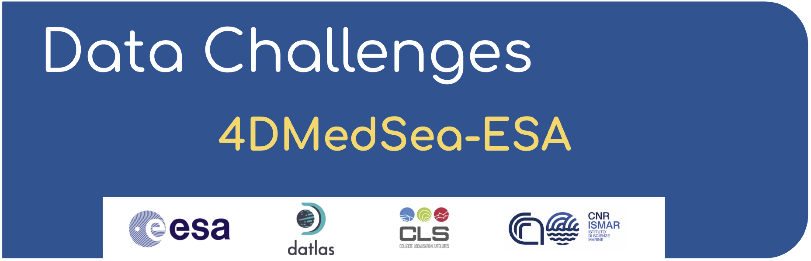

# Check out the data challenge [website](https://2024c-dc-4dmedsea-esa.readthedocs.io) for more infos !

  

# 2024c - DC  4DMedSea  ESA

This repository contains codes and sample notebooks for downloading and processing the 2024c 4DMedSea mapping data challenge.
Note that this data challenge is a somewhat extended version of the data challenge [2021a_SSH_mapping_OSE](https://github.com/ocean-data-challenges/2021a_SSH_mapping_OSE) in the Mediterranean Sea.

So far, the github page visits amount to: 

# 1.The 4DMedSea project

This ITT is part of the ESA Mediterranean Regional Initiative aimed at exploring and exploiting the huge synergistic opportunities offered by the increasing EO European satellite capacity together with in-situ observations, advanced models and novel technologies (AI, ICTs, cloud computing capacity, HPCs) to enhance observations over the Mediterranean region, advance the scientific understanding of the role of the Mediterranean area in the Earth and climate system and transfer that knowledge into new solutions for society.In addition, this activity makes part of the ESA Ocean Science Cluster and contributes to the joint EC-ESA Earth System Science Initiative launched in February 2020 by the European Space Agency and the European Commission (EC) Directorate-General for Research and Innovation (DG RTD) to jointly advance Earth System Science and its response to the global challenges that society is facing in the onset of this century. In particular, this activity is a contribution to the EC-ESA Flagship Action on Ocean Health aimed at developing advanced ocean observations and products and enhancing the scientific understanding of the ocean's role in the Earth and climate system and its responses to management actions to contribute to reverse the cycle of decline in ocean health and improve conditions for sustainable development of the Ocean. 

  

 

In that context, the overarching objectives of the 4DMED ITT are to exploit the synergy offered by the increasing EO European satellites together with in-situ observations, advanced physical/biogeochemical/ecological models and novel technologies to develop a data-driven, 4D reconstruction of the Mediterranean Sea physical and biogeochemical state, exploit this information to further improve our understanding of the complex interactions between physical and biological processes at a broad range of temporal and spatial scales and explore options to transfer that knowledge into new solutions for society regarding the monitoring, restoration and preservation of the Mediterranean Sea Health.
 
 
# 2. 4DMedSea Data Challenges
 

**For more info on the objectives, the experimental setup and the results of the WOC data challenges: [Check out the 4DMedSea data challenges website !](https://2024c-dc-4dmedsea-esa.readthedocs.io/)**

  
 
# 3. Get started
 

## [Installation documentation](https://2024c-dc-4dmedsea-esa.readthedocs.io//en/latest/1_getstarted/getstarted_install.html)

## [Download the data documentation](https://2024c-dc-4dmedsea-esa.readthedocs.io//en/latest/1_getstarted/getstarted_data.html)

## [Input specification documentation](https://2024c-dc-4dmedsea-esa.readthedocs.io//en/latest/1_getstarted/getstarted_eval.html)
  
  
 

