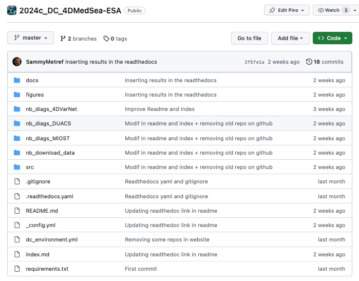

# Navigate the GitHub

  

   
 
 Now that you have cloned the GitHub repo (see [Installation](https://2024c-dc-4dmedsea-esa.readthedocs.io/en/latest/1_getstarted/getstarted_install.html)), you can navigate within the repo. 
 
 

  

 
**Repositories**

- **docs**: Documentation for the readthedocs webpages,

- **figures**: Figures produced in the notebooks,

- **nb_diags_4DVarNet**: Evaluation notebooks of the 4DVarNet mapping, 

- **nb_diags_DUACS**: Evaluation notebooks of the DUACS all sat. mapping, 

- **nb_diags_MIOST**: Evaluation notebooks of the MIOST mapping, 

- **nb_download_data**: Illustration notebooks to download and use the data, 

- **src**: Scripts to process the data and compute the metrics. 

There are also several files needed for the readthedocs documentation and other configuration files. Note that **dc_environment.yml** is needed to create the conda environment necessary to run the notebooks without any python package issue (see [Installation](https://2024c-dc-4dmedsea-esa.readthedocs.io/en/latest/1_getstarted/getstarted_install.html)).  
