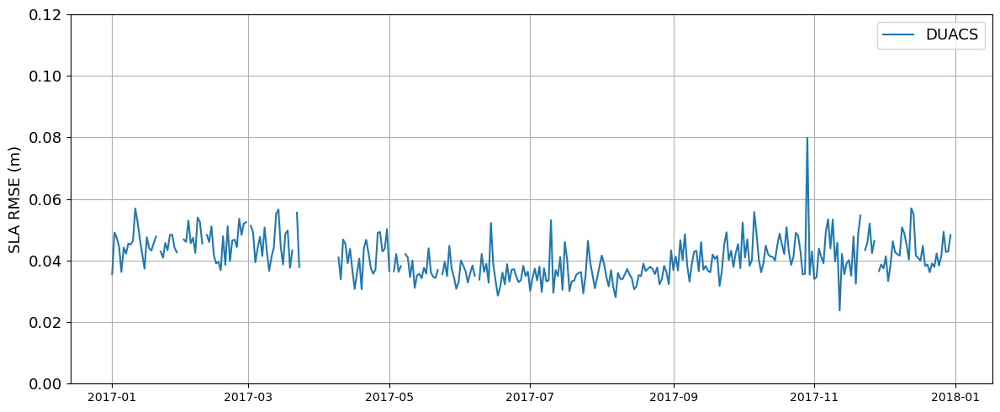
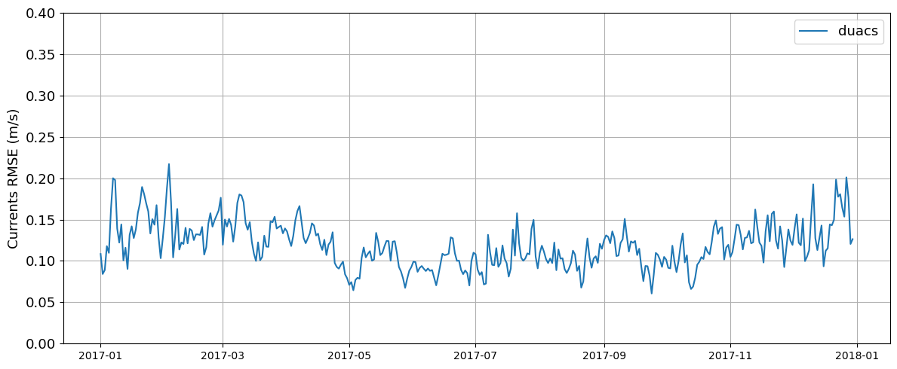
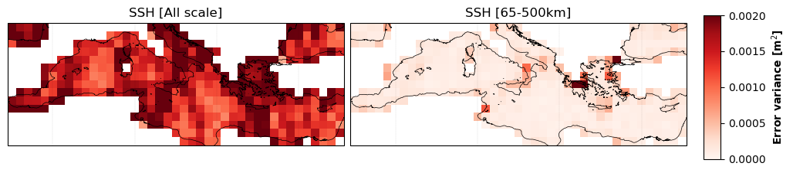
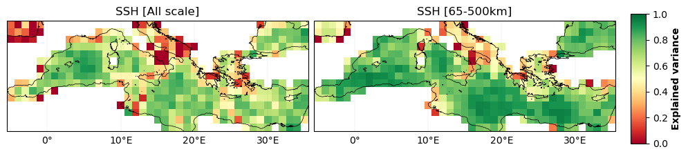
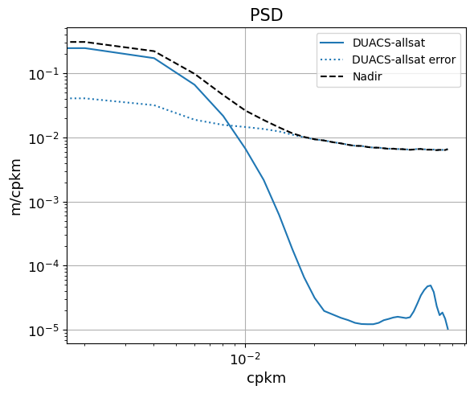
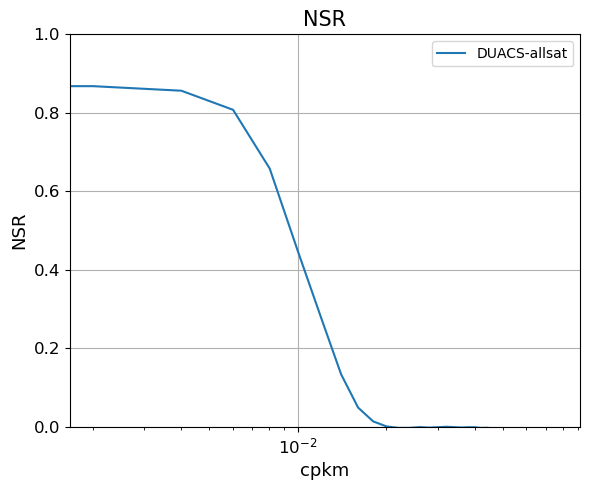
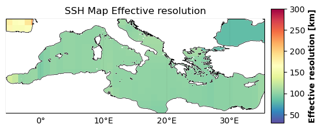

# DUACS -- all sat

 
 

    

##  Total RMSE

- **Total RMSE = 0.041**

- **RMSE score = 0.63**
 

 

##  Temporal RMSE

- **SSH**

  

- **Currents**

  
 
 

## Error variance 

  

 

## Explained variance 

  

 

##  Averaged  alongtrack spectral scores

| |  |
| -- | -- |

 
 

## Effective resolution 

- **Total effective resolution = 103.0 km**

 
 
   

## Lagrangian cumulative distance 

| |
|--|
| | 
| | 
| | 
| |

   