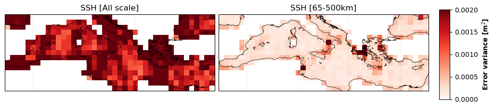
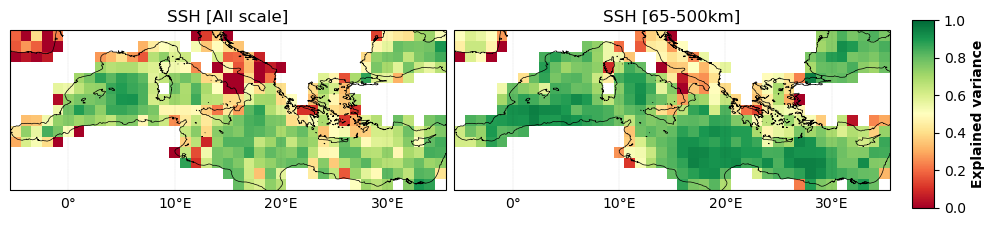

# MIOST

 
 

     

##  Total RMSE
 
- **Total RMSE = 0.046**

- **RMSE score = 0.55**
 

##  Temporal RMSE

- **SSH** 

  

- **Currents** 

  
 
 
 

## Error variance

  

 

## Explained variance 

  

 
 

##  Averaged  alongtrack spectral scores

| |  |
| -- | -- |
 

 
 

## Effective resolution 

- **Total effective resolution = 121.3 km**

 
 
