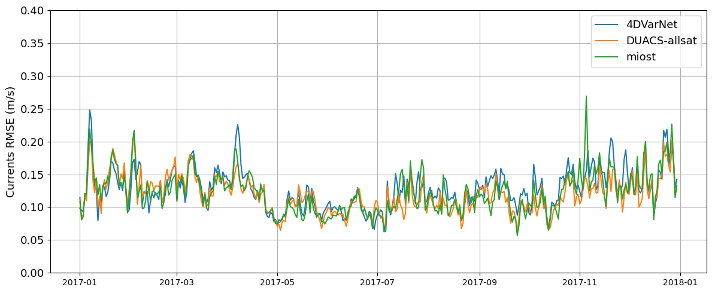

# Overall evaluation

 
 

 

##  Scores overview 
  
### Independant nadir evaluation

|               | SSH RMSE | SSH RMSE score | SSH Effective res. | 
|---------------|------|------------|----------------|
|**DUACS (all sat)**|0.041 |0.63        |103.0 km        |
|**MIOST**          |0.046 |0.55        |121.3 km        |

### Independant drifter evaluation

|               | u RMSE | u RMSE score | v RMSE | v RMSE score |  
|---------------|--------|--------------|--------|--------------|
|**DUACS (all sat)**| 0.121  | 0.35         | 0.125  | 0.31         | 
|**MIOST**          | 0.128  | 0.31         | 0.127  | 0.29         |

 

 

##  Independant nadir evaluation

### Temporal RMSE
 

  

###  Averaged  alongtrack spectral scores

| |  |
| -- | -- |

 

## Independant drifter evaluation

### Temporal RMSE
 
  

 

###  Lagrangian Cumulative Distance

  

 

## Movies 

 
 