# Independant drifter evaluation
  
    
## Error statistics 
    

Error variance maps
  

  

- **MIOST vs DUACS**

|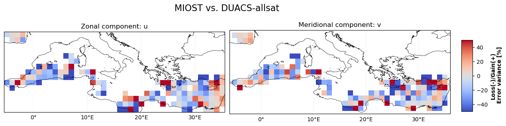 |   
| -- | 
   
- **4DVarNet vs DUACS**

|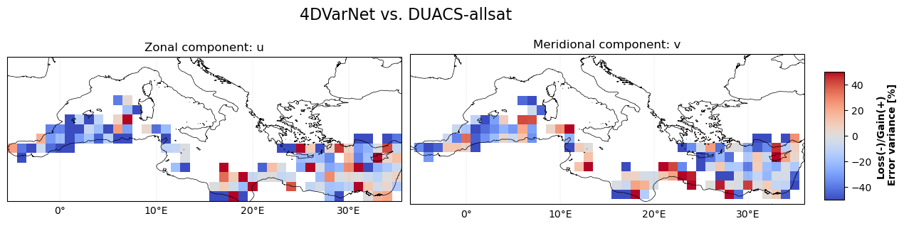 | 
| -- | 
   
   
- **MIOST vs 4DVarNet**

|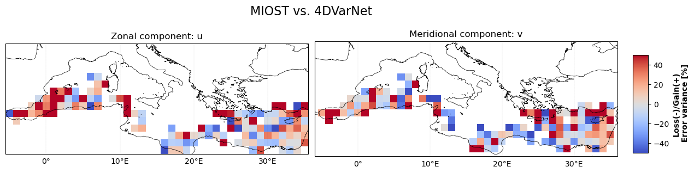 |   
| -- |  
   

 

Explained variance maps
  

  

- **MIOST vs DUACS**

|  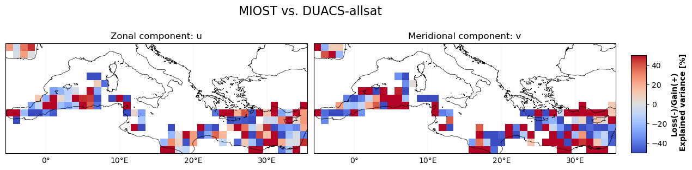|
| -- | 
   
- **4DVarNet vs DUACS**

|  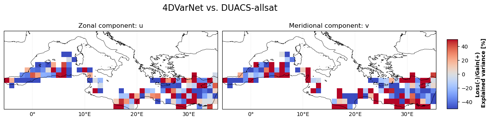|
| -- |  
   
   
- **MIOST vs 4DVarNet**

|  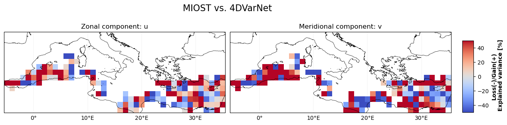|
| -- |  
   

 

RMSE time serie
 
    
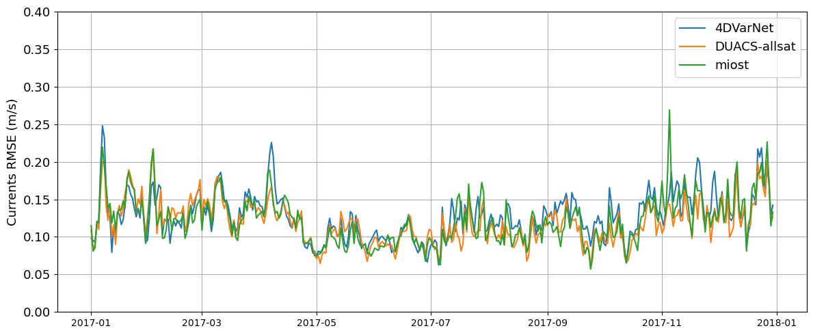  
 

 
 

## Lagrangian Cumulative Distance 

Distance maps
  

|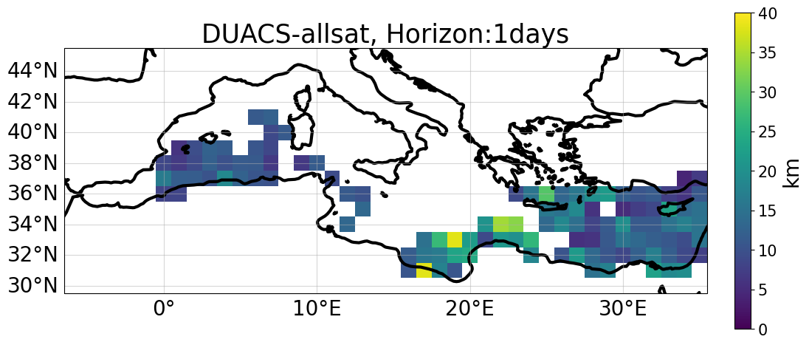 | 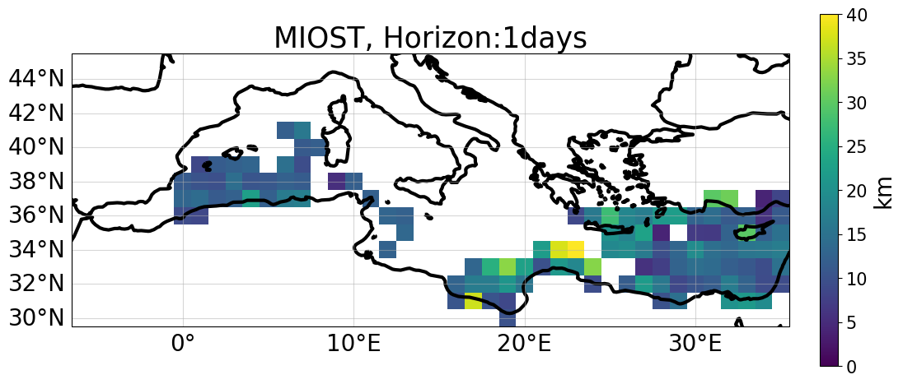 | 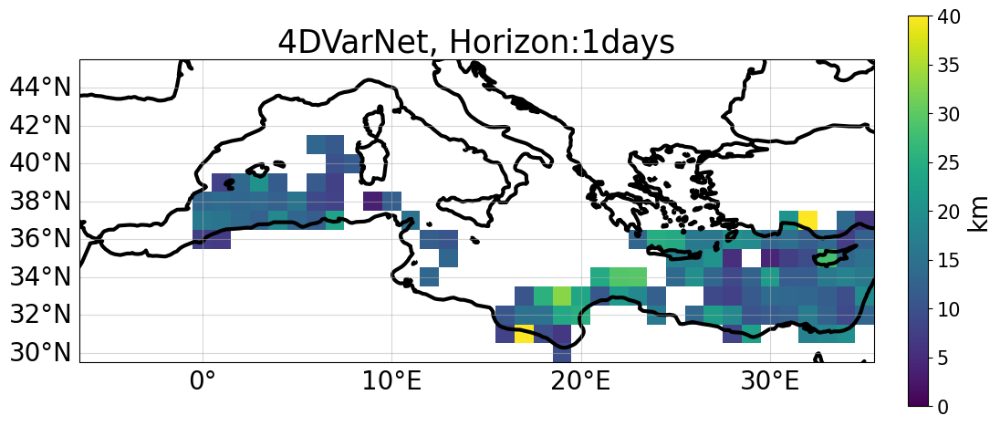 |
|--|--|--|
|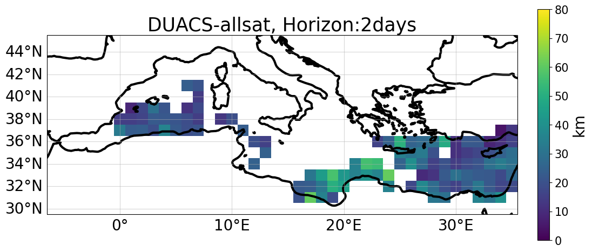 |  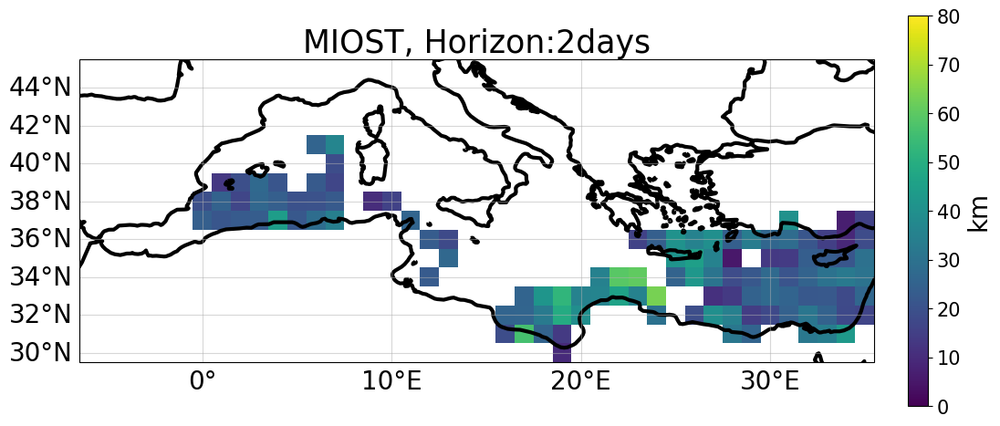 |  |
|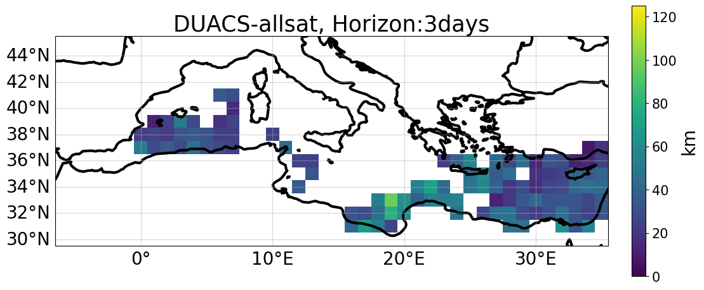 |  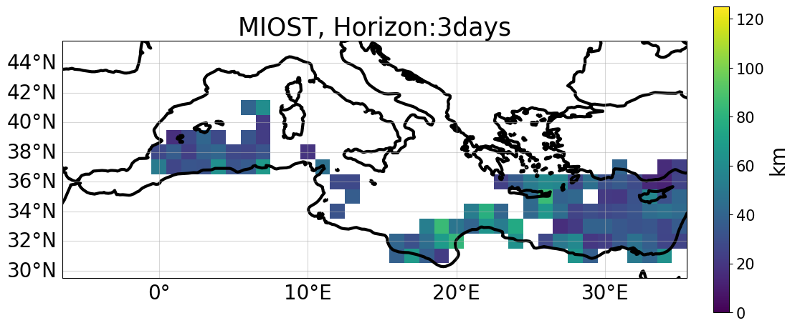 | 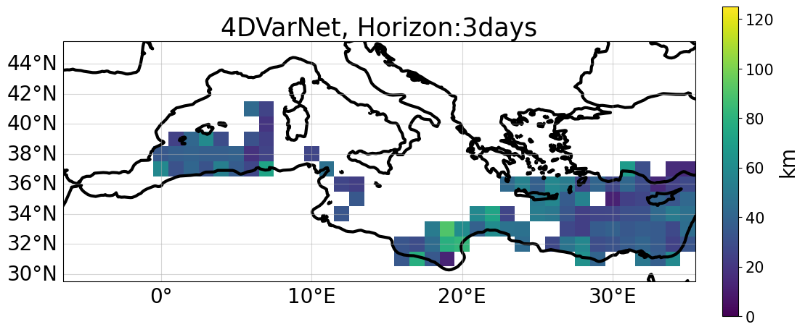 |
|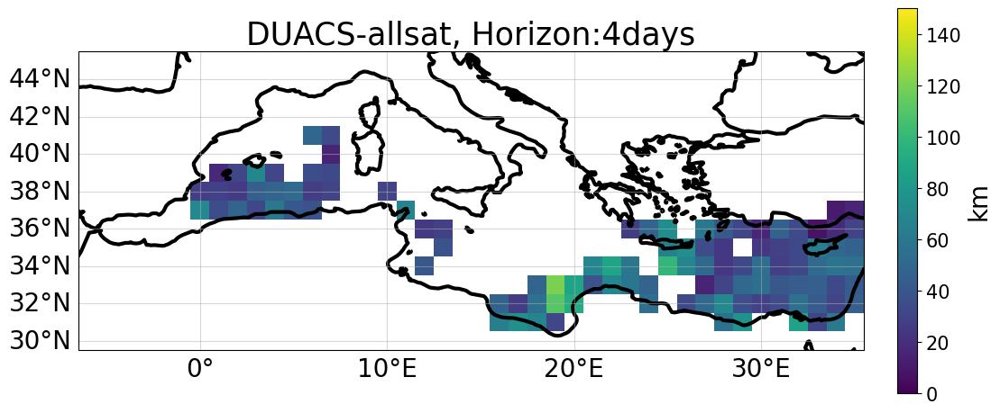 |  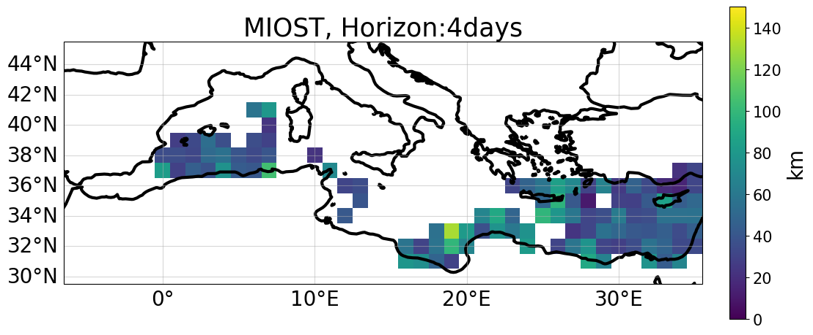 | 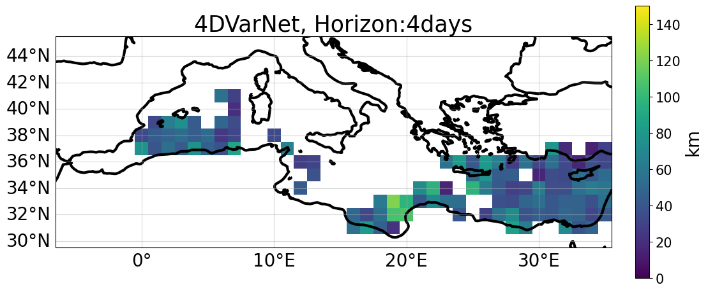 |
|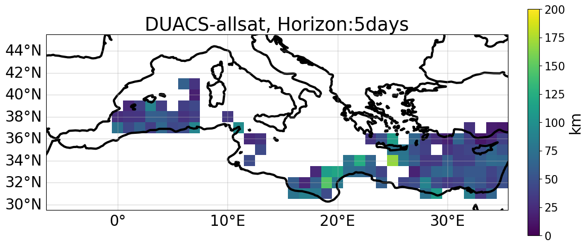 | 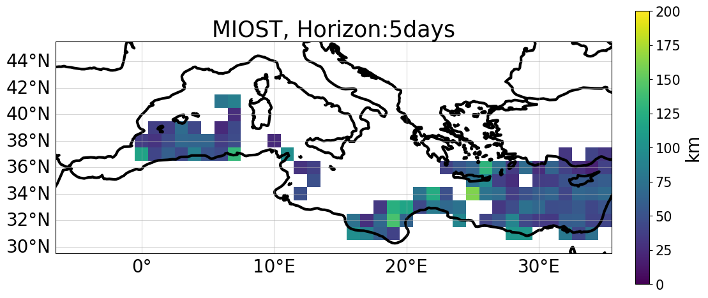 | 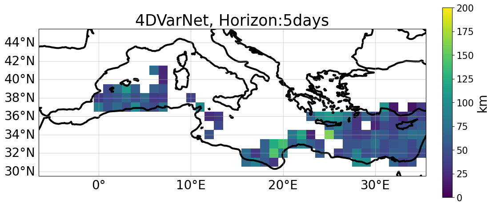 |

  

Horizon plot
  
    
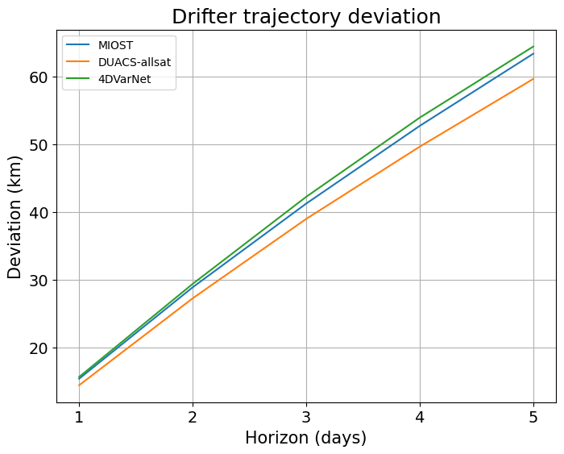  
 

 
  
 