# Independant trajectory evaluation
  
## Drifter distribution

Drifter maps ⤵️ 
  

  

|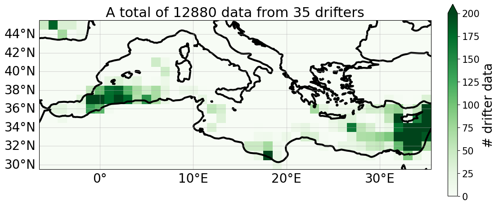 |   
| -- | 
  

   
 
 

## Lagrangian Cumulative Distance 

Distance maps ⤵️ 
  

| | 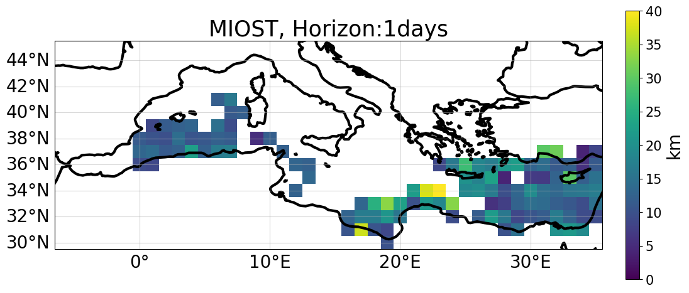 | 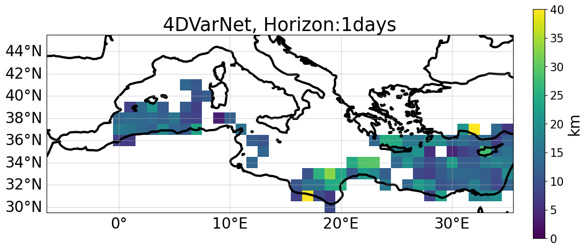 |
|--|--|--|
| |   | 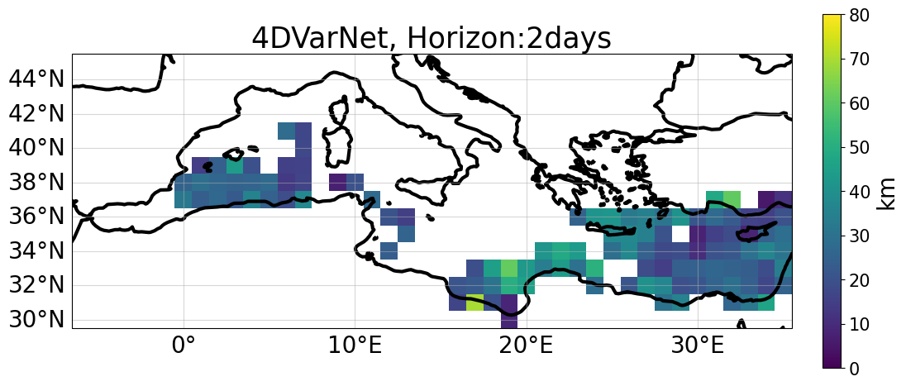 |
| |  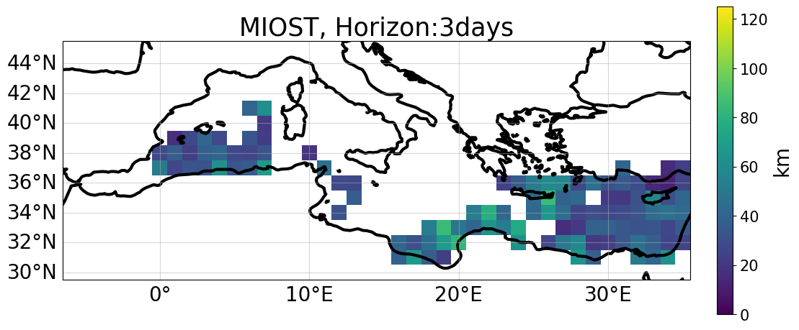 | 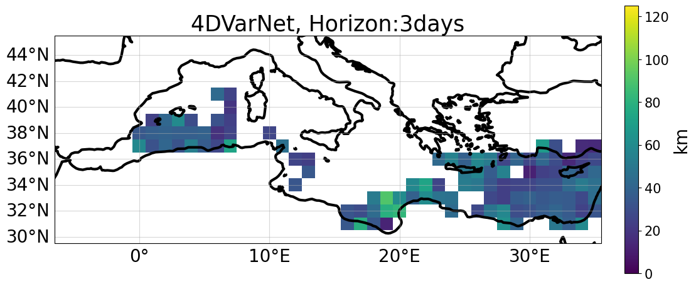 |
|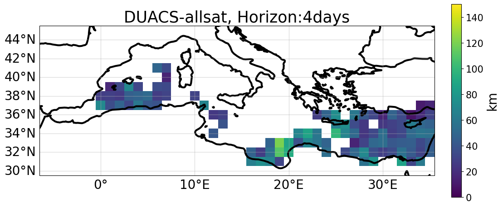 |  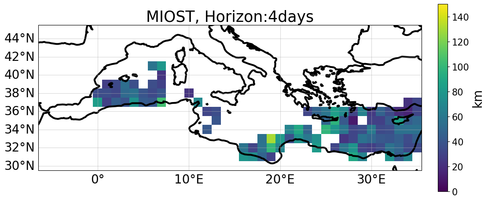 | 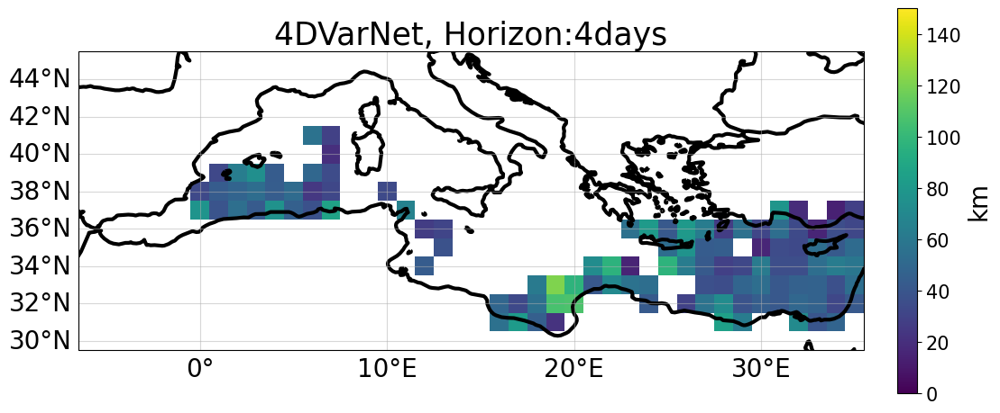 |
|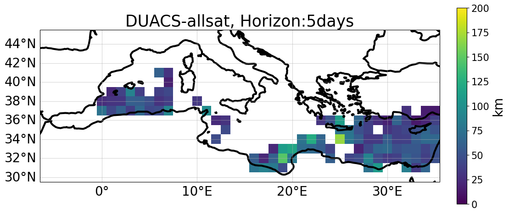 | 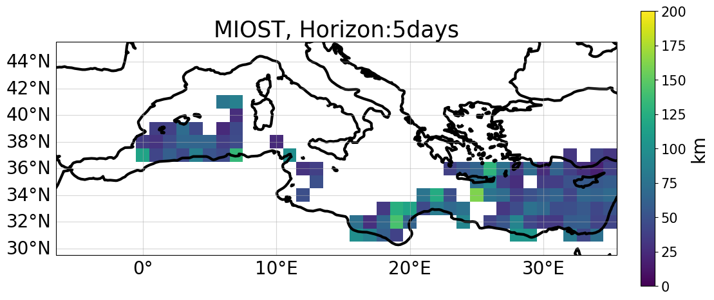 | 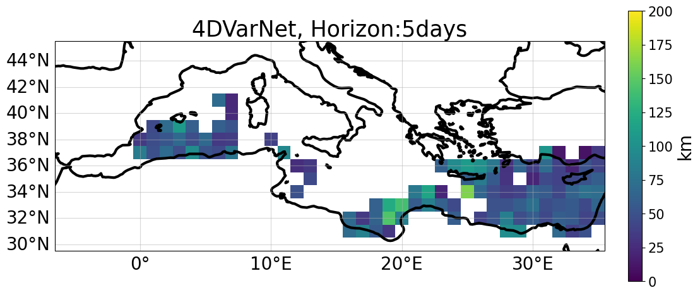 |

  

Horizon plot ⤵️ 
  
    
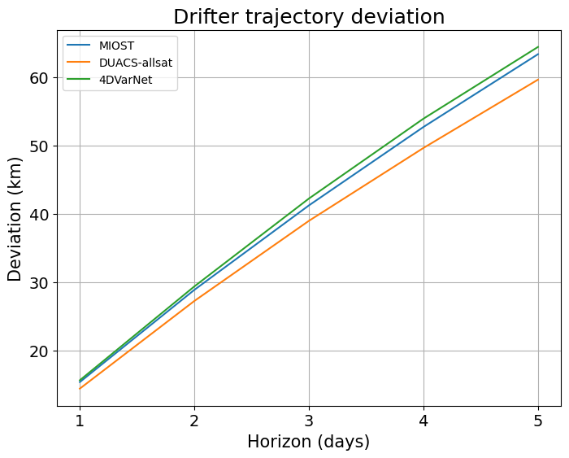  
 

 
  
 