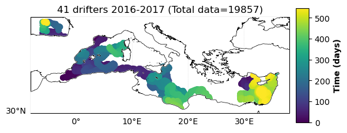
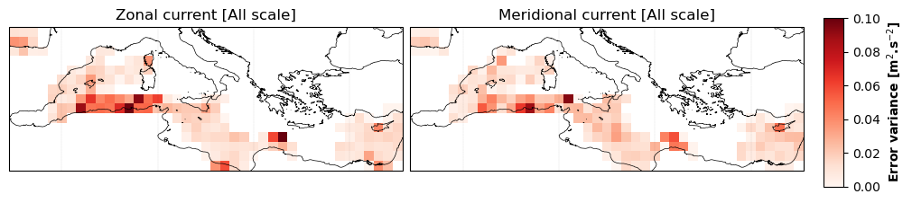
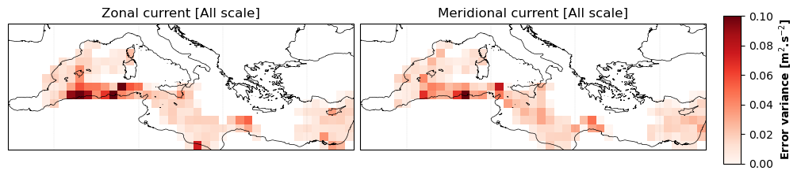
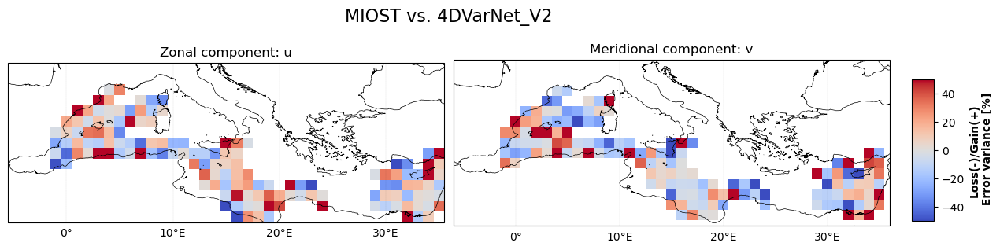
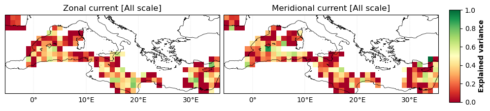
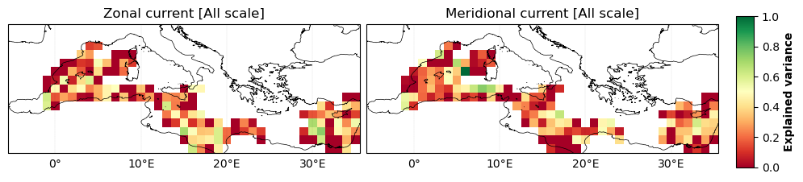
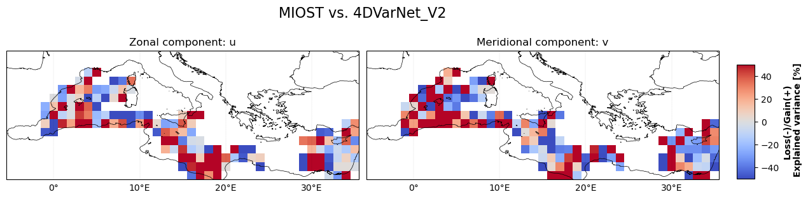
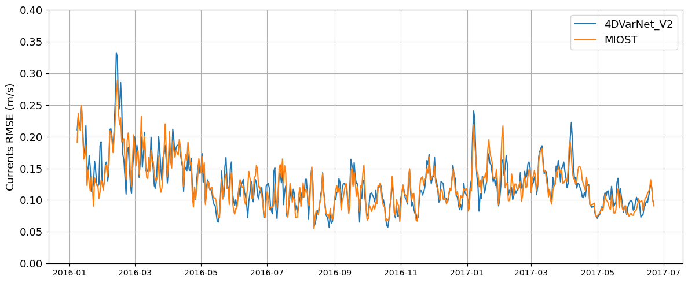

# Independant drifter evaluation
  
## Drifter distribution

Drifter maps ⤵️ 
  

  

| |    
| -- | 
  

 
    
## Error statistics 
    

Error variance maps ⤵️ 
  

   
   
   
- **MIOST**

| |  
| -- | 
   
   
- **4DVarNet**

| |  
| -- | 
   
   
- **MIOST vs 4DVarNet**

| |   
| -- |  
   

 

Explained variance maps ⤵️ 
  

   

- **MIOST**

| |  
| -- | 
   
   
- **4DVarNet**

| |  
| -- | 

   
- **MIOST vs 4DVarNet**

|  |
| -- |  
   

 

RMSE time serie ⤵️ 
 
    
  
 

 
 
 
 