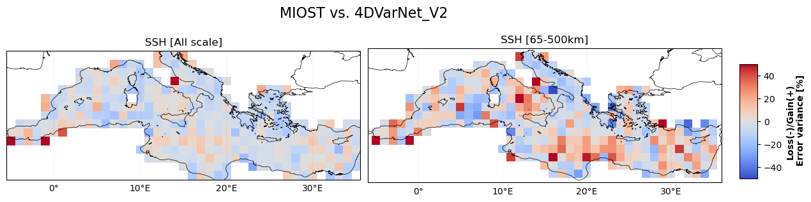
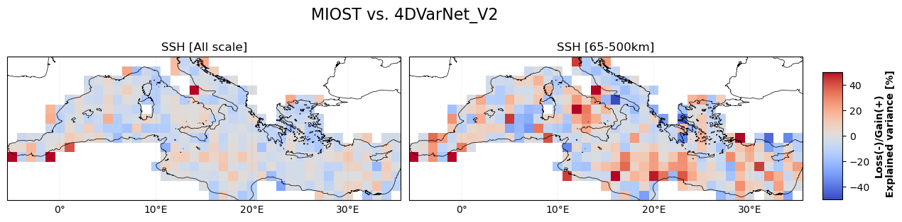
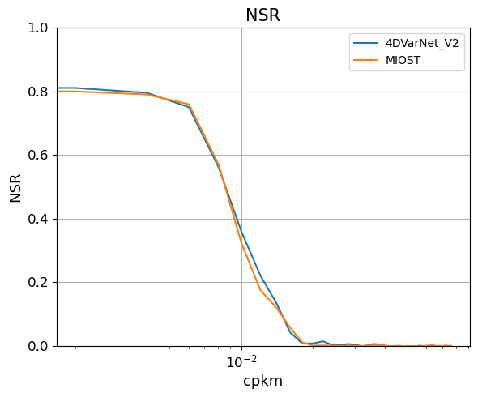

# Independant nadir evaluation
 
 
## Error statistics 
    

    
Error variance maps ⤵️ 
 

 
 
   
- **MIOST vs 4DVarNet**

| |  
| -- | 
   

 

Explained variance maps ⤵️ 
 

  
   
- **MIOST vs 4DVarNet**

|  |
| -- | 
   

 

RMSE time serie ⤵️ 
 
    
  
 

 
 
 
 

## Alongtrack spectral scores 

    

Averaged power spectrum density and noise-to-signal ratio ⤵️ 
 
    
| |  |
| -- | -- |
   

 
 

 

Effective resolution maps ⤵️ 
 

  
   
- **MIOST vs 4DVarNet**

| |  |
| -- | -- |
   

 
 