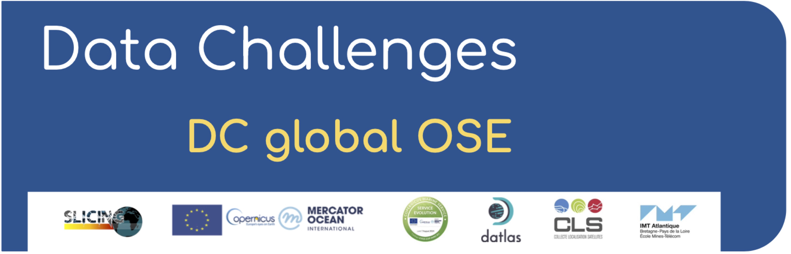
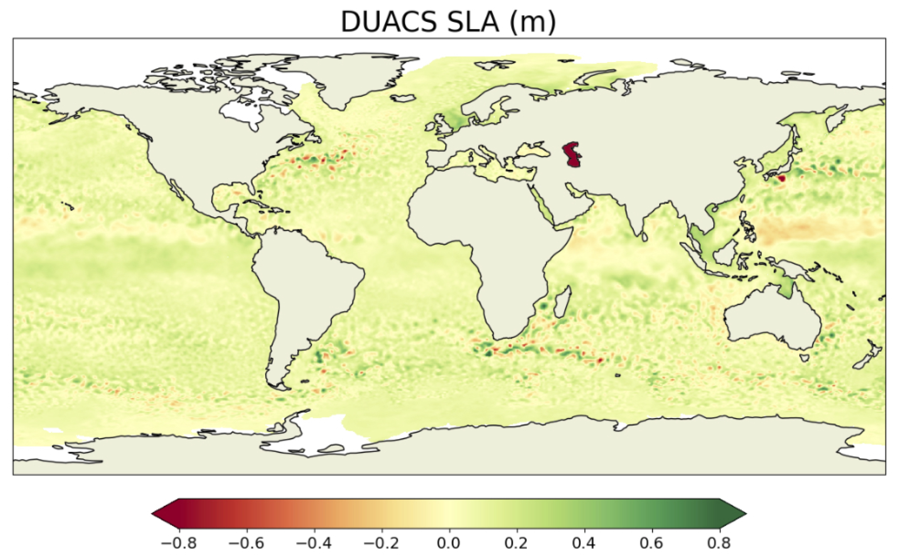

.. 2023a_SSH_mapping_OSE documentation master file, created by
   sphinx-quickstart on Fri Jul 21 14:53:11 2023.
   You can adapt this file completely to your liking, but it should at least
   contain the root `toctree` directive.

ODC - global OSE mapping
=================================================

.. role:: raw-html(raw)
    :format: html

:raw-html:` `

:raw-html:` `

.. raw:: html

    <embed>  
        So far, the github page visits amount to:  
     
    
     
        
    </embed>
    
    

Context & Motivation
--------------------

The Copernicus Marine Service (CMEMS) is committed to providing high-quality, state-of-the-art ocean products through the validation and verification of physical oceanic parameters on both global and regional scales. Among the variables distributed by the service, ocean surface topography and surface currents are of great interest to the oceanographic communities for practical applications and for scientific research.

Several mapping techniques, such as statistical interpolation methods or ocean model assimilation methods, are currently proposed to provide operational maps of ocean surface heights and currents. New mapping techniques (e.g. data-driven methods) are emerging and being tested in a research and development context.
It is therefore becoming important to inform users and developers about the accuracy of scale represented by each mapping system.

The goal of the present data-challenge is to investigate how to best reconstruct sequences of Sea Surface Height (SSH) and surface current maps from partial satellite altimetry observations and from a global perspective. This data challenge follows a Real Data Experiment framework: Satellite observations are from real sea surface height data from altimeter. The practical goal of the challenge is to investigate the best mapping method according to scores described below and in Jupyter notebooks.

Observations
------------

The SSH observations used in this study comprise data from a nadir altimeter constellation that includes Jason 3, Sentinel 3A, Sentinel 3B, Haiyang-2A, Haiyang-2B, and Cryosat-2. These data are distributed by the Copernicus Marine Service [(https://doi.org/10.48670/moi-00146)](https://doi.org/10.48670/moi-00146) and cover the period from January 1st, 2019 to December 31st, 2019. The Saral/AltiKa altimeter data are excluded from the mapping process to enable an independent assessment of the different reconstructions.

In addition, independent assessment of ocean surface currents is performed using in situ data, which are also distributed by CMEMS [(https://doi.org/10.17882/86236)]( https://doi.org/10.17882/86236).

Data sequence and use
---------------------

The SSH reconstructions are assessed at global scale and over the period from 2019-01-01 to 2019-12-31.

For reconstruction methods that need a spin-up, the **observations** from other period can be used.

The altimeter data from Saral/AltiKa and surface current velocity data mentioned above should never be used so that any reconstruction can be considered uncorrelated to the evaluation period.

Regional evaluations: select your region
-----------------------------------------
    
.. raw:: html

    <embed> 
        

        
 <map name="map_example"> <area href="https://2023a-ssh-mapping-ose.readthedocs.io/en/latest/2_eval_generic/eval_generic_GS.html" target="_blank" alt="DC-GulfStream" shape=poly coords="310,155, 310,135, 340,135, 340,155"> <area href="https://2023a-ssh-mapping-ose.readthedocs.io/en/latest/2_eval_generic/eval_generic_WM.html" target="_blank" alt="DC-Western Mediterranean" shape=poly coords="490,150, 490,115, 530,115, 530,150"> <area href="https://2023a-ssh-mapping-ose.readthedocs.io/en/latest/2_eval_generic/eval_generic_NA.html" target="_blank" alt="DC-North Atlantic" shape=poly coords="225,220, 225,45, 475,45, 475,220"> <area href="https://2023a-ssh-mapping-ose.readthedocs.io/en/latest/2_eval_generic/eval_generic_global.html" target="_blank" alt="DC-Global" shape=poly coords="0,1000, 0,0, 1000,0, 1000,1000"> </map> 
 

    </embed>

----------------- 

:raw-html:` `
 
    
.. toctree::
   :maxdepth: 2
   :caption: Get started

   1_getstarted/getstarted_install.md
   1_getstarted/getstarted_data.md 
   1_getstarted/getstarted_eval.md

.. toctree::
   :maxdepth: 1
   :caption: Generic evaluation

   2_eval_generic/eval_generic_global.md
   2_eval_generic/eval_generic_NA.md
   2_eval_generic/eval_generic_WM.md
   2_eval_generic/eval_generic_GS.md

.. toctree::
   :maxdepth: 1
   :caption: Specific focus

   3_spec_focus/eval_nio_rotaryspec.md
 

.. toctree::
   :maxdepth: 1
   :caption: Notebooks

   4_notebooks/notebooks_evaluation.md
   4_notebooks/notebooks_download_data.md
   
.. toctree::
   :maxdepth: 1
   :caption: Metrics details

   5_metrics_det/metrics_alongtrack.md
   5_metrics_det/metrics_alongdrifter.md
   5_metrics_det/metrics_driftertraj.md

.. toctree::
   :maxdepth: 2
   :caption: Scripts

   6_scripts/modules.rst
